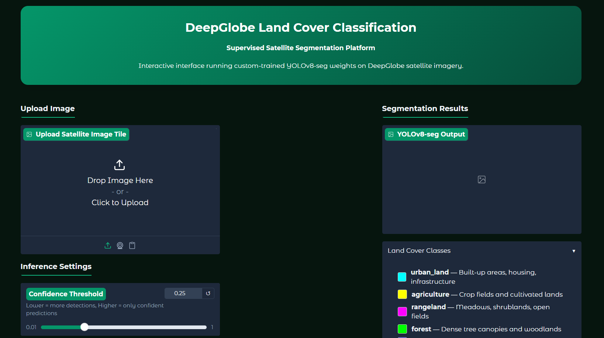
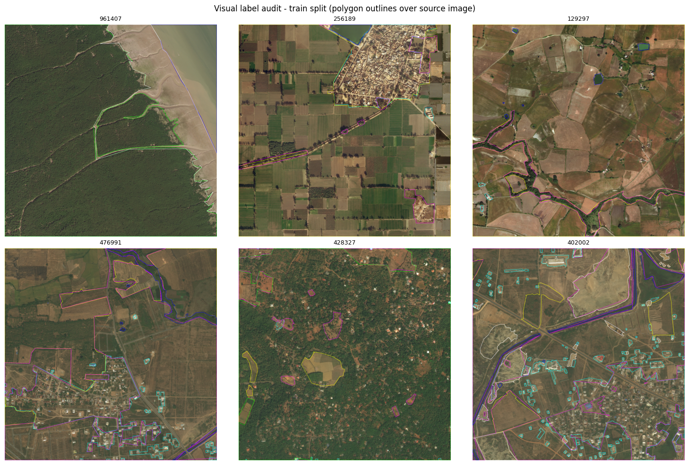
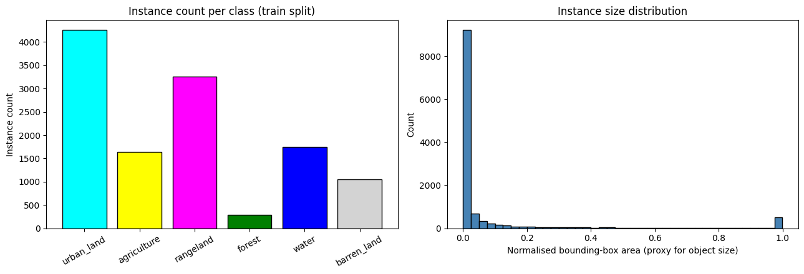
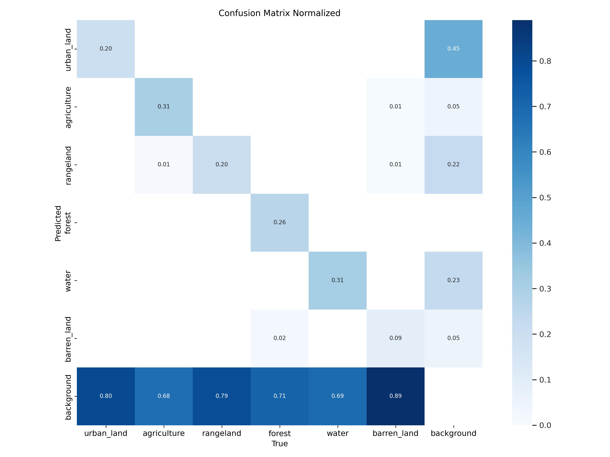
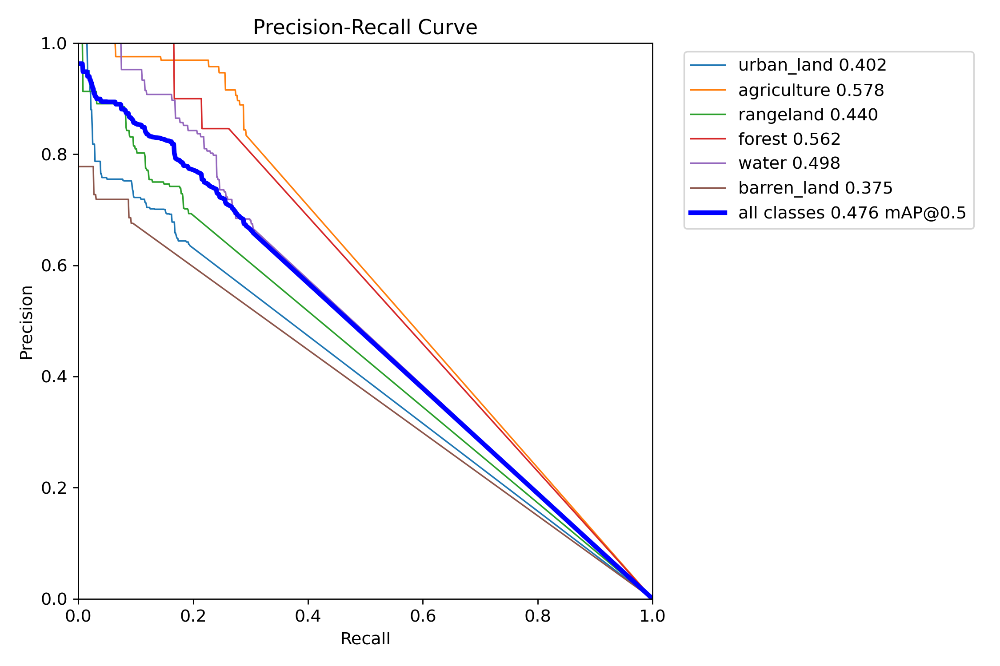
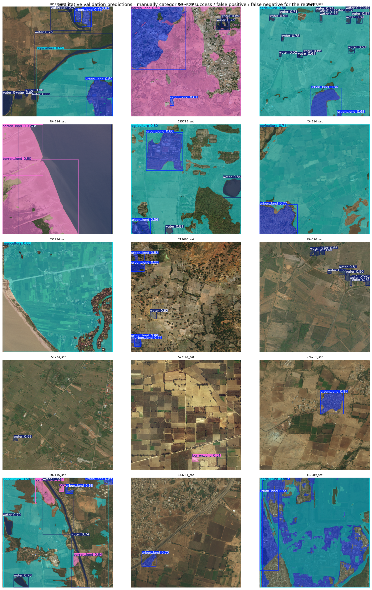
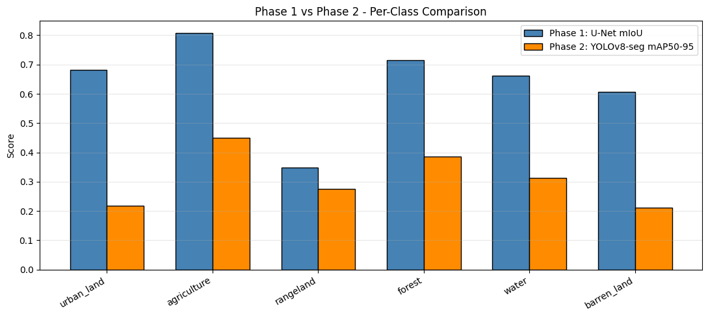

# Land Cover Classification — YOLOv8-seg
 
Instance segmentation of satellite imagery using a custom-trained YOLOv8-seg model on the DeepGlobe Land Cover dataset. The model classifies land cover into 6 categories directly from high-resolution satellite images.
 
> A semantic segmentation approach to the same problem is available at [Land-Cover-Classification](https://github.com/AbdullahAhmed04/Land-Cover-Classification).
 
---
## App Preview


## Results
 
**Best experiment: E1 (augmentation-enhanced YOLOv8s-seg)**
 
| Metric | Value |
|---|---|
| mAP50 (mask) | 0.335 |
| mAP50-95 (mask) | 0.185 |
| Precision | 0.484 |
| Recall | 0.329 |
| Inference latency | 20.42 ms |
| FPS | 49.0 |
| Model size | 21.3 MB |
| Hardware | Tesla T4 (Kaggle) |
 
### Per-Class AP (mAP50-95, mask)
 
| Class | AP |
|---|---|
| agriculture | 0.451 |
| forest | 0.386 |
| rangeland | 0.275 |
| water | 0.313 |
| urban_land | 0.218 |
| barren_land | — |
 
### Experiment Comparison
 
| Experiment | Model | Change from baseline | mAP50 | mAP50-95 | Best Epoch |
|---|---|---|---|---|---|
| E0 — Baseline | YOLOv8s-seg | Default settings | 0.325 | 0.162 | 50 |
| E1 — Augmentation | YOLOv8s-seg | Rotation + copy-paste + mixup | 0.335 | 0.185 | 49 |
| E2 — Larger model | YOLOv8m-seg | Bigger model, batch halved | 0.322 | 0.163 | 43 |
 
E1 (augmentation) produced the best results. The larger model in E2 did not outperform the baseline, likely due to the reduced batch size offsetting any capacity gains.
 
---
 
## Dataset
 
**DeepGlobe Land Cover Classification**
- Source: [Kaggle — balraj98](https://www.kaggle.com/datasets/balraj98/deepglobe-land-cover-classification-dataset)
- 803 satellite images at 2448×2448px with pixel-wise RGB masks
- Coverage: Thailand, Indonesia, India
- Split: 85% train (682 images) / 15% validation (121 images), seed 42
**Preprocessing — Mask to Polygon Conversion:**
DeepGlobe provides pixel-wise masks. YOLOv8-seg requires polygon annotations. Each class region was extracted via `cv2.findContours`, approximated using `cv2.approxPolyDP`, and saved in YOLO format (normalised coordinates). Contours smaller than 80px² were filtered as noise.
 
**Instance counts per class (train split):**
 
| Class | Instances |
|---|---|
| urban_land | 4257 |
| rangeland | 3251 |
| water | 1740 |
| agriculture | 1642 |
| barren_land | 1045 |
| forest | 289 |
 
Forest is severely underrepresented (289 instances vs 4257 for urban_land), which directly explains its lower AP. Median instance area is 0.0037 (normalised) — much smaller than typical YOLO use cases.
 
---
 
## Model Architecture
 
```
Input (640×640 RGB)
       |
  YOLOv8s-seg backbone    pretrained on COCO
       |
  Feature Pyramid Neck    multi-scale feature fusion
       |
  Segmentation Head       6-class polygon mask output
                          10.5M parameters, 34.8 GFLOPs
```
 
- **Library:** Ultralytics 8.3.0
- **Task:** Instance segmentation
- **Pretrained weights:** COCO
- **Optimizer:** Auto (AdamW)
- **Input size:** 640×640
- **Epochs:** 50 (patience 20)
- **Batch size:** 16
---
 
## Experiments
 
| | E0 | E1 | E2 | E3 |
|---|---|---|---|---|
| Model | YOLOv8s-seg | YOLOv8s-seg | YOLOv8m-seg | Best of E0-E2 |
| Change | Baseline | Augmentation | Larger model | Threshold tuning |
| degrees | 0 | 180 | 0 | — |
| copy_paste | — | 0.3 | — | — |
| mixup | — | 0.15 | — | — |
| batch | 16 | 16 | 8 | — |
| conf threshold | — | — | — | 0.35 |
| iou threshold | — | — | — | 0.50 |
 
E3 swept confidence (0.15, 0.25, 0.35, 0.50) and IoU (0.50, 0.70) on the best checkpoint. Final thresholds: conf=0.35, iou=0.50.
 
---
 
## Results Gallery
 
| Visual Audit | Instance Statistics |
|---|---|
|  |  |
 
| Confusion Matrix | PR Curve |
|---|---|
|  |  |
 
| Qualitative Predictions | Comparison with U-Net |
|---|---|
|  |  |
 
---
 
## Comparison with U-Net Approach
 
The [Land-Cover-Classification](https://github.com/AbdullahAhmed04/Land-Cover-Classification) repo implements the same task using U-Net + ResNet-50 semantic segmentation.
 
| Class | U-Net mIoU | YOLOv8-seg mAP50-95 |
|---|---|---|
| agriculture | 0.809 | 0.451 |
| forest | 0.714 | 0.386 |
| urban_land | 0.682 | 0.218 |
| water | 0.662 | 0.313 |
| barren_land | 0.607 | — |
| rangeland | 0.348 | 0.275 |
 
**Note:** mIoU (pixel-wise, no confidence threshold) and mAP50-95 (instance-level, threshold-dependent) are not directly equivalent metrics. The comparison is directional, not precise.
 
U-Net scores higher on all classes because semantic segmentation is a better natural fit for land cover — land cover has no discrete countable instances, just continuous pixel-level regions. YOLOv8-seg was designed for object detection use cases (cars, people, animals) where instance boundaries and confidence scores are meaningful. Applying it to land cover introduces an architectural mismatch that limits maximum achievable accuracy.
 
YOLOv8-seg's advantage is inference speed — **49 FPS at 20.42ms latency** versus U-Net which was not benchmarked for real-time use. For applications requiring fast inference on a stream of satellite tiles, YOLOv8-seg is the more practical choice despite the accuracy trade-off.
 
---
 
## Reproduction
 
1. Upload `notebook2f8942fec3.ipynb` to a new Kaggle notebook
2. Add the DeepGlobe dataset via **+ Add Data**: `balraj98/deepglobe-land-cover-classification-dataset`
3. Set accelerator to **GPU T4 x2**
4. Run all cells — the first cell handles environment setup automatically
**Note:** The W&B callback in Ultralytics 8.3.0 conflicts with Kaggle's environment. The notebook patches this automatically by writing a stub `wb.py` before each training cell.
 
---
 
## Limitations
 
- No independent test set — DeepGlobe's official test split has no public ground truth masks. The validation split (121 images) serves as the final evaluation set
- Forest class underperforms due to severe class imbalance (only 289 training instances)
- Instance segmentation is architecturally mismatched with land cover classification — regions have no natural "instance" boundaries
- Trained only on DeepGlobe source regions (Thailand, Indonesia, India) — generalisation to other geographies is untested
---
 
## References
 
1. Demir, I. et al. *DeepGlobe 2018: A Challenge to Parse the Earth through Satellite Images.* CVPR Workshops, 2018.
2. Ultralytics. *YOLOv8 Documentation.* https://docs.ultralytics.com
3. Redmon, J. & Farhadi, A. *YOLOv3: An Incremental Improvement.* arXiv:1804.02767, 2018.
---
 
## License
 
Code: MIT License.
DeepGlobe dataset: see [original challenge terms](https://competitions.codalab.org/competitions/18468).
